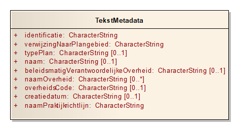

# Metadata {#6CD320A3}

Metadata zijn gegevens over gegevens. Bepaalde metadata zijn in de gegevensset opgenomen. Onderstaand diagram en tabel geven de gegevens weer die als metadata in het plantekstenbestand in de klasse TekstMetadata zijn opgenomen. 
<figure></img>
<figcaption>TekstMetadata</figcaption></figure>

De klasse TekstMetadata bevat een aantal algemene kenmerken die van toepassing zijn op de gehele tekst. Er is van deze klasse dus ook altijd maar één object per plan aanwezig. 
Een groot deel van deze algemene eigenschappen hoort bij het plan als geheel (dus inclusief geometrie). Deze eigenschappen zijn bij de (geometrisch bepaalde) klasse Plangebied <a href='https://docs.geostandaarden.nl/ro/imro' target='_blank'>(IMRO2012)</a> of in de metadata van de GML ondergebracht. De tekst is daaraan gekoppeld. Een objectgerichte plantekst kan dus nooit zelfstandig bestaan. Altijd is minimaal één plangebied vereist.

In <a href='#T020'>Tabel 20</a> wordt de klasse TekstMetadata beschreven, de waarden aangegeven die deze attributen moeten bevatten en wordt aangegeven hoe vaak het attribuut voorkomt. Na de tabel wordt per attribuut een nadere toelichting gegeven. 
<table style='width: 100%;' id='T020'><caption>Tabel 20 Klasse TekstMetadata</caption>
<colgroup><col id='col1' style='width: 27.920952270888712%;'>
<col id='col2' style='width: 8.193690049693748%;'>
<col id='col3' style='width: 63.885357679417545%;'>
</colgroup>
<thead valign='top'><tr><th align='left'>Klasse 
</th>
<th align='left' colspan='2'>TekstMetadata 
</th>
</tr>
</thead>
<tbody valign='top'><tr><td align='left'>Definitie 
</td>
<td align='left' colspan='2'>Kenmerken die van toepassing zijn op de gehele tekst. 
</td>
</tr>
<tr><td align='left'>Herkomst definitie  
</td>
<td align='left' colspan='2'>IMROPT 
</td>
</tr>
<tr><td align='left' colspan='3'>Attributen 
</td>
</tr>
<tr><td align='left'><i>Attribuutnaam</i> 
</td>
<td align='left'><b>m*</b> 
</td>
<td align='left'><b>Toelichting</b> 
</td>
</tr>
<tr><td align='left'>identificatie 
</td>
<td align='left'>1 
</td>
<td align='left'>eigen identificatie (idn) van de TekstMetadata . De code moet uniek zijn binnen het plantekstenbestand. De identificatie begint met "NL.IMRO.PT." en wordt gevolgd door max. 32 alfanumerieke tekens. 
De volgende reguliere expressie is van toepassing: NL\.IMRO\.PT\.[A-Za-z0-9_\-,\.]{1,32} 
</td>
</tr>
<tr><td align='left'>verwijzingNaarPlangebied 
</td>
<td align='left'>1 
</td>
<td align='left'>identificatie (idn) van het IMRO Plangebied waar het plantekstenbestand bij hoort. 
</td>
</tr>
<tr><td align='left'>typePlan 
</td>
<td align='left'>0..1 
</td>
<td align='left'>de waarde van het attribuut typePlan van het Plangebied waar het plantekstenbestand bij hoort. 
</td>
</tr>
<tr><td align='left'>naam  
</td>
<td align='left'>0..1 
</td>
<td align='left'>volgens de (aanhaal)titel 
</td>
</tr>
<tr><td align='left'>beleidsmatigVerantwoordelijkeOverheid 
</td>
<td align='left'>0..1 
</td>
<td align='left'>één van de waarden volgens domein Overheden_XX 
</td>
</tr>
<tr><td align='left'>naamOverheid 
</td>
<td align='left'>0..n 
</td>
<td align='left'>volgens format in de vorm: gemeente …., deelgemeente/ stadsdeel …., provincie …. of ministerie ….; alleen bij meerdere verantwoordelijke ministeries wordt naamOverheid evenzoveel ingevuld 
</td>
</tr>
<tr><td align='left'>overheidsCode 
</td>
<td align='left'>0..1 
</td>
<td align='left'>4 cijfers; ingeval Rijk: "0000"; ingeval provincie: CBS-nummer provincie, met voorafgaand 2 voorloopnegens; indien deelgemeente/stadsdeel: CBS-nummer gemeente 
</td>
</tr>
<tr><td align='left'>creatiedatum 
</td>
<td align='left'>0..1 
</td>
<td align='left'>in de vorm: jjjj-mm-dd 
</td>
</tr>
<tr><td align='left'>naamPraktijkrichtlijn 
</td>
<td align='left'>1 
</td>
<td align='left'>de vaste waarde PRPT2012 
</td>
</tr>
</tbody>
</table>

